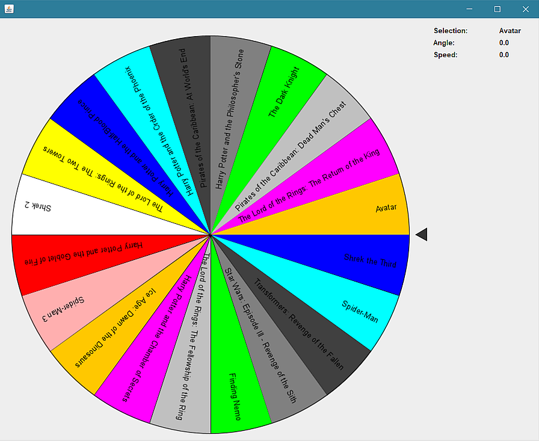

# Selection Wheel

[](https://github.com/daniilperkin-uni/pe1_selection_wheel/actions/workflows/ci.yml)

A reusable Swing-based wheel-of-fortune selector library for teaching purposes.
Originally developed as a PE1 WS24/25 exercise project; refactored into a
testable, well-architected Java library with Maven build, full TDD coverage,
and an event-driven EDT-safe API.



## Quick Start

### Prerequisites

- **JDK 21 or later** (verified with Oracle JDK 21.0.5)
- No Maven install required — the Maven Wrapper is bundled

### Build and Run

```bash
# Run the application
./mvnw.cmd exec:java        # Windows
./mvnw exec:java            # macOS / Linux

# Or compile and run manually
./mvnw.cmd compile
java -cp target/classes selectionwheel.MainWheel
```

### Run Tests

```bash
./mvnw.cmd test             # Windows
./mvnw test                 # macOS / Linux
```

> **Headless Linux:** the integration tests instantiate Swing components
> (`SelectionWheelIntegrationTest`), which need a display. On a headless
> Linux box (CI, server, WSL without an X server) wrap the build in
> `xvfb-run` to provide a virtual framebuffer:
>
> ```bash
> xvfb-run -a mvn test
> ```

### Package

```bash
./mvnw.cmd package          # produces target/selection-wheel-1.0.0-SNAPSHOT.jar
```

## How to Use

1. **Drag** the wheel with the mouse to rotate it manually.
2. **Release** to start a decelerating spin (speed depends on drag velocity).
3. **Click** the wheel while spinning to stop it immediately.
4. **Press Space or Enter** (or click the **Spin** button) to start a random spin.
5. The selected item appears in the result bar at the bottom (no modal popup).

### Customizing the Wheel

The item list is loaded from `src/main/resources/itemlist.txt` — one item per line.
Edit this file to change the selectable items (max 100 items, non-empty),
or use the **Load list...** button to load a UTF-8 text file at runtime.

## Architecture

```
┌─────────────────────────────────────────────────────┐
│                    MainWheel                         │
│              (JFrame + layout + keyboard)            │
├─────────────────────────────────────────────────────┤
│                  SelectionWheel                      │
│            (JPanel: Wheel + Tick composite)          │
├──────────────────┬──────────────────────────────────┤
│      Wheel       │             Tick                  │
│   (JPanel view)  │        (JPanel view)              │
│      ┌────┐      │                                  │
│      │Model│     │  ┌──────────┐                    │
│      │ ────│     │  │ TickMath │ (pure polygon ops) │
│      └────┘      │  └──────────┘                    │
└──────┼───────────┴──────────────────────────────────┘
       │
       ▼
┌──────────────┐  ┌──────────────┐  ┌──────────────┐
│  WheelModel  │  │  WheelMath   │  │   SpinStep   │
│ (pure state) │  │ (pure math)  │  │ (immutable)  │
└──────────────┘  └──────────────┘  └──────────────┘
```

### Model / View / Controller Split

| Layer            | Classes                          | Responsibility                          |
|------------------|----------------------------------|-----------------------------------------|
| **Model**        | `WheelModel`                     | Pure state: items, rotation, spin params. No Swing. |
| **Math (pure)**  | `WheelMath`, `SpinStep`, `TickMath` | Stateless functions: selection index, drag delta, spin physics, polygon geometry. |
| **View**         | `Wheel`, `WheelRenderer`, `Tick`, `SelectionWheel` | Swing `JPanel` subclasses. Render the model, route mouse/keyboard events. |
| **Controller**   | `Wheel` (mouse listeners)        | Translates user input into model mutations + fires `WheelListener` events. |
| **Entry point**  | `MainWheel`                      | Creates the `JFrame`, wires listeners to labels, keyboard shortcuts. |

### Threading Contract

- All `Wheel` mutators (`setRotationAngle`, `spinStartAsync`, `spinStop`, `setItems`, ...)
  must be called on the **Swing EDT**.
- `spinStartAsync` and `spinStop` are EDT-aware: they marshal to the EDT via
  `SwingUtilities.invokeLater` if called from another thread.
- `WheelListener` callbacks are always delivered on the EDT.
- Spin animation runs on a `javax.swing.Timer` (EDT-native), not a raw `Thread`.
- A spin ends on its own deceleration, on `spinStop`, or when the `Wheel`
  component is removed from its container (`removeNotify`) - a detached
  wheel never keeps its timer running.

## Extending the Wheel

### Adding a New Shape

1. Add a new enum constant to `Wheel.Shape` (e.g., `HEXAGON`).
2. Implement the drawing method in `WheelRenderer` (e.g., `fillHexagon(Graphics2D, double)`).
3. Add a branch in `WheelRenderer` where the section fill is chosen by shape.

### Adding a New Data Source

The default `ContentReader.importListOfItems()` reads from the classpath resource
`itemlist.txt`. To load items from a database, API, or other source:

```java
public class MyContentReader {
    public static ArrayList<String> loadItems() {
        // Your custom loading logic
        return items;
    }
}

// In MainWheel.main():
ArrayList<String> items = MyContentReader.loadItems();
```

### Using the Wheel as a Library

```java
// Create a wheel with custom items
SelectionWheel wheel = new SelectionWheel(items);
wheel.hasBorders(true);
wheel.setMaxSpinSpeed(720);          // degrees per second
wheel.setSpinDeceleration(-50);      // degrees per second^2
wheel.setTickVisible(true);

// Listen for events
wheel.addWheelListener(new WheelListener() {
    @Override
    public void spinStopped() {
        System.out.println("Selected: " + wheel.getSelectedItem());
    }
});

// Programmatically spin
wheel.spinStartAsync(360, 1, -20);   // 360 deg/s, counter-clockwise, -20 deg/s^2
```

## Testing

The project uses JUnit 5 + AssertJ. Tests are organized by layer:

| Test Class                      | Tests | Coverage                                     |
|---------------------------------|-------|----------------------------------------------|
| `WheelMathTest`                 | 27    | Section angle, normalization, selection index, speed clamping, drag delta |
| `SpinStepTest`                  | 10    | Spin physics: forward/reverse, deceleration, perpetual, argument validation |
| `TickMathTest`                  | 11    | Triangle geometry, polygon scaling/centering, idempotency (regression for cumulative-scaling bug) |
| `WheelModelTest`                | 26    | Construction, setItems, rotation, selection, spin lifecycle, full spin integration |
| `SelectionWheelIntegrationTest` | 8     | Component-level: bounds, tick visibility, listener delivery, spin lifecycle, detach stops the spin |
| `ContentReaderTest`             | 9     | Resource loading, missing/blank resource, empty/oversized lists, content verification, trimming |
| `ContentReaderFileTest`         | 5     | Loading items from a user-chosen text file |
| `MainWheelRandomTest`           | 4     | Injected random spin source |
| `WheelRendererTest`             | 1     | Offscreen rendering smoke test |
| **Total**                       | **101**|                                              |

```bash
./mvnw.cmd test           # run all tests
./mvnw.cmd test -Dtest=WheelModelTest   # run a single test class
```

## Project Structure

```
pe1_selection_wheel/
├── pom.xml                          # Maven build (JDK 21, JUnit 5, AssertJ)
├── mvnw / mvnw.cmd                  # Maven Wrapper (no global Maven install needed)
├── .mvn/wrapper/                    # Wrapper config
├── README.md                        # This file
├── wheel.png                        # Screenshot
└── src/
    ├── main/
    │   ├── java/selectionwheel/
    │   │   ├── MainWheel.java       # Entry point: JFrame, layout, keyboard
    │   │   ├── SelectionWheel.java  # Composite: Wheel + Tick
    │   │   ├── Wheel.java           # View: routes events, delegates painting
    │   │   ├── WheelRenderer.java   # Paints the wheel image (sections, text)
    │   │   ├── WheelModel.java      # Model: pure state (items, rotation, spin)
    │   │   ├── WheelMath.java       # Pure math: selection index, drag delta
    │   │   ├── SpinStep.java        # Immutable record: one tick of spin physics
    │   │   ├── Tick.java            # View: renders the pointer
    │   │   ├── TickMath.java        # Pure math: polygon scaling/centering
    │   │   ├── ContentReader.java   # IO: loads itemlist.txt from classpath
    │   │   └── WheelListener.java   # Observer: selectionChanged, spinStopped, ...
    │   └── resources/
    │       └── itemlist.txt         # Default selectable items (one per line)
    └── test/
        └── java/selectionwheel/
            ├── WheelMathTest.java
            ├── SpinStepTest.java
            ├── TickMathTest.java
            ├── WheelModelTest.java
            ├── SelectionWheelIntegrationTest.java
            ├── ContentReaderTest.java
            ├── ContentReaderFileTest.java
            ├── MainWheelRandomTest.java
            └── WheelRendererTest.java
```
